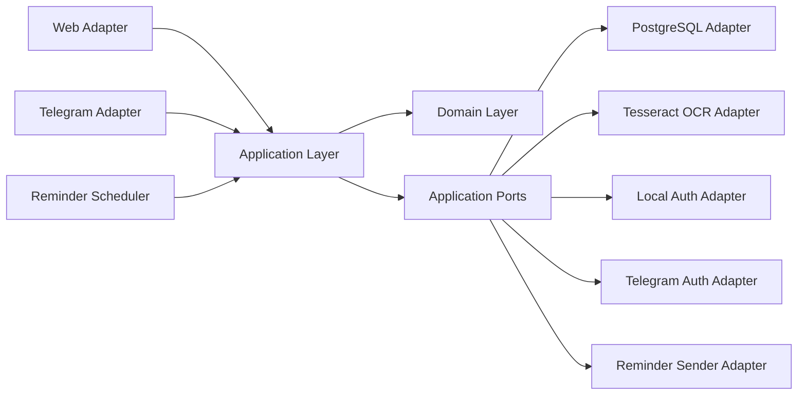
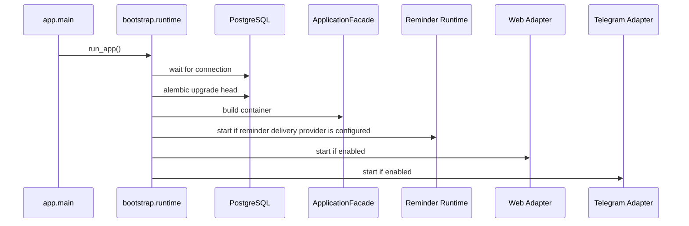

# Architecture

## Purpose

The system is built as a platform core with thin delivery adapters.
Business rules, workflow state, ranking, parsing, and persistence contracts live outside Telegram and outside HTTP.

Current primary platform surface: web with local credentials.
Current secondary adapter: Telegram.

Important nuance:

- the architecture is web-first
- code defaults and `.env.example` now default to web-first local mode
- Telegram features are opt-in by config rather than implied by bootstrap defaults

## Layer Map

## Responsibilities

### Domain

Location: `app/domain`

Contains transport-neutral business entities and domain rules.

Examples:

- `UserAccount`
- `UserIdentity`
- `LocalCredentials`
- `DeliveryTarget`
- `BankAggregate`
- `CashbackDraftItem`
- category normalization and ranking services

The domain must not import FastAPI, aiogram, SQLAlchemy, or adapter code.

### Application

Location: `app/application`

Contains use cases, workflow state, transport-neutral screen models, and infrastructure ports.

Main areas:

- `app/application/auth`: registration, login, external identity auth, link, unlink
- `app/application/dto`: neutral DTOs such as `ImageUpload`
- `app/application/use_cases`: business operations for banks, history, reminders, OCR processing
- `app/application/workflow`: workflow contracts, dispatcher, scenario handlers
- `app/application/presenters`: screen factories and formatting helpers

Important rule:

application code may depend on domain and application contracts only.

### Adapters

Location: `app/adapters`

Concrete integration layer.

- `postgres`: repositories, unit of work, SQLAlchemy models
- `auth_local`: password hashing and verification
- `auth_telegram`: Telegram Login verification
- `telegram`: aiogram routing and rendering
- `web`: FastAPI routes, sessions, SSR templates
- `ocr_tesseract`: image-to-text extraction from `ImageUpload`
- `system`: reminder delivery helpers

Adapters may depend on application contracts.
Application and domain must not depend on adapters.

### Bootstrap

Location: `app/bootstrap`

Owns runtime wiring only:

- settings loading
- logging
- database readiness
- migrations
- container assembly
- adapter startup
- reminder loop lifecycle when a reminder delivery provider is configured

## Identity Model

The platform no longer treats Telegram as the canonical user identity.

Tables:

- `users`: platform account
- `user_identities`: linked external identities such as Telegram
- `local_credentials`: local username/email/password hash

Design consequences:

- a web user can exist without Telegram
- a Telegram identity can be linked to an existing platform account
- reminder routing is derived from linked identities, not from columns on `users`

Compatibility note:

- legacy `users.telegram_user_id`, `username`, and `full_name` still exist in persistence as a transitional compatibility seam
- new business logic must treat `user_identities` as the authoritative external identity source
- new runtime writes no longer mirror linked Telegram identities back into those legacy columns

## Authentication Model

### Web

Supports:

- local registration
- local login
- logout
- Telegram identity link and unlink

Unlinked Telegram callbacks are not allowed to silently create arbitrary web sessions.
They are accepted only for an already linked identity or for explicit linking from an authenticated session.

### Telegram

Telegram adapter maps `from_user` into `ExternalIdentityContext(provider="telegram", ...)` locally and then calls the shared external identity authentication use case.
This preserves bot-first compatibility while keeping the platform model neutral.

## Workflow Model

The product remains screen-driven.
Adapters translate transport events into a shared `UserCommand` contract and render the returned `Screen`.

`WorkflowState` stores draft and navigation state such as:

- selected bank
- target month
- draft items
- pending input kind
- edit pointer
- interrupt target

`Screen` contains:

- screen id
- title/body localization keys
- action list
- optional input expectation
- optional layout hint

Current workflow split:

- `dispatcher.py`: orchestration and routing
- `interrupts.py`: interrupt policy
- `draft.py`: draft creation/edit/save flow
- `banks.py`: saved-bank flow
- `navigation.py`: home/help/top/settings/history flow
- `text_intents.py`: free-text routing
- `workflow_screens.py`: `Screen` construction
- `workflow_formatters.py`: screen body formatting

This allows Telegram and web to reuse the same logical workflow semantics.

## Month Snapshot Model

Cashback data is now stored as month-aware snapshots instead of one mutable bank state.

Implications:

- the same bank can have different category sets for `previous`, `current`, and `next` month
- OCR/manual/template ingestion resolves into a draft first, then the draft is attached to a bank and a target month
- bank details and edit flow are month-aware, so the user can browse and adjust snapshots without overwriting another month unintentionally

Persistence consequences:

- `cashback_items` contains `target_month`
- repository operations are month-scoped for list/replace behavior
- ranking uses the current month snapshot only

## OCR And Attach Flow

The simplified ingestion flow is intentionally transport-neutral:

1. adapter sends image bytes or text into workflow
2. workflow parses categories into a draft
3. if a bank is already selected, preview opens immediately
4. if exactly one saved bank exists, workflow auto-selects it
5. otherwise workflow opens explicit attach-to-bank screen
6. user confirms target month and saves

Design goal:

- screenshots and photos should lead directly to a useful next action instead of dumping the user into a dead-end OCR result

## File Upload Model

OCR no longer depends on filesystem paths in the application contract.

The application works with `ImageUpload`:

- `content: bytes`
- `filename: str`
- `content_type: str`

Any temporary file handling stays inside the concrete adapter.

## Reminder Delivery

Monthly reminders are now resolved through delivery targets from linked identities.

Current operational behavior:

- the reminder use case queries `user_identities` through `list_delivery_targets(...)`
- the delivery provider is injected by bootstrap/runtime wiring through `REMINDER_DELIVERY_PROVIDER`
- the sender adapter delivers a `DeliveryTarget`
- `bootstrap.runtime` owns the reminder loop lifecycle
- Telegram bot remains the current delivery implementation, not the owner of the scheduler
- the bundled compose posture assigns reminder ownership to the Telegram profile service only
- transport routing is adapter-owned

This removes the old assumption that `users.telegram_user_id` is the only delivery address.

## Runtime Flow

## Invariants

- `app.domain` imports no adapter or framework code.
- `app.application` imports no adapter package or ORM model.
- `app.application.workflow` imports no framework or persistence boundary directly.
- `app.application.presenters` imports no adapter code.
- `app.adapters.web` does not import `app.adapters.telegram`.
- shared localization lives in `app.i18n`.
- adapters are replaceable without rewriting business rules.

## Residual Technical Debt

The major workflow decomposition is complete.
The current residual debt is narrower and more explicit:

- `app/application/workflow/draft.py` is the largest workflow module and the next hotspot to watch
- legacy Telegram columns are still present in the schema as a deprecated compatibility seam
- only Telegram reminder delivery implementation exists today; other providers are still future work

These are compatibility and maintenance concerns, not architecture blockers.
