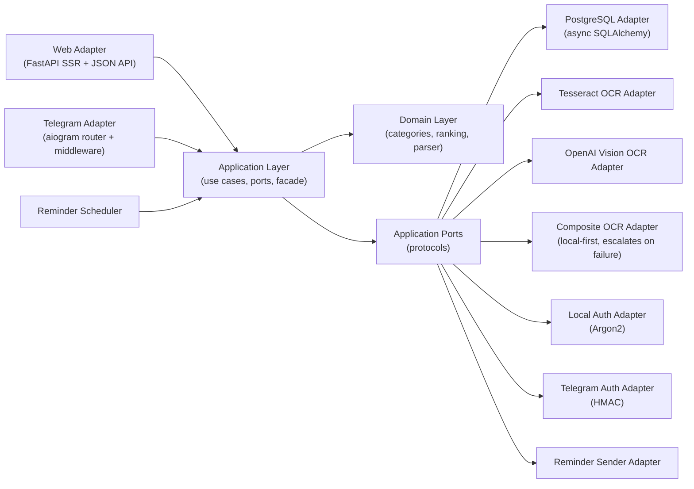
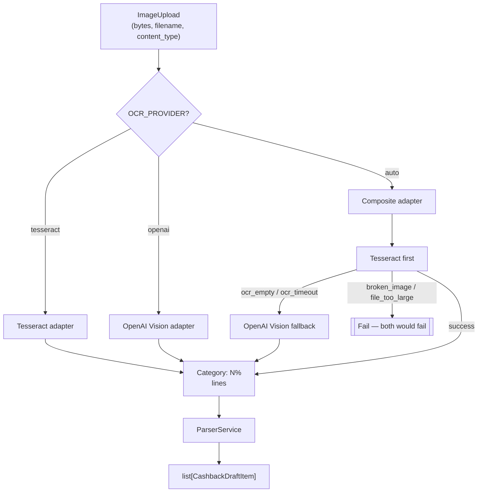
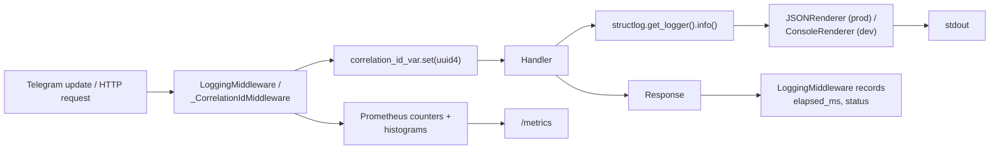

# Architecture

## Purpose

The system is built as a **platform core with thin delivery adapters**.
Business rules, workflow state, ranking, parsing, and persistence contracts
live outside Telegram and outside HTTP. This means:

- A second delivery channel (e.g. mobile native) can be added without
  touching domain logic.
- All use cases can be unit-tested without a running Telegram bot or web
  server — the in-memory UoW in `tests/conftest.py` stands in for Postgres.
- A third transport quirk (a CLI tool, a webhook from a billing provider)
  plugs in at the adapter layer and inherits every invariant the core
  enforces.

Current primary platform entry point: **web with local credentials**.
Current secondary adapter: **Telegram** (polling or webhook).

---

## Layer Map



Dependency direction: **outward-in is forbidden**. Domain doesn't know about
application ports, application doesn't know about adapters, adapters don't
know about each other (with one explicit exception — adapters sharing
cross-cutting utilities via `app/adapters/rate_limit.py`).

These invariants are enforced by `tests/test_architecture_boundaries.py`.

---

## Responsibilities

### Domain (`app/domain`)

Transport-neutral business entities and rules.

| Module | Contents |
|---|---|
| `models.py` | `UserAccount`, `UserIdentity`, `LocalCredentials`, `Bank`, `CashbackDraftItem`, `ReminderTarget`, `NormalizedCategory`, `CategoryLeader`, `UserLogEntry` |
| `errors.py` | `DomainError` hierarchy: `NotFoundError`, `ValidationError`, etc. Every error carries a translation key like `errors.bank_not_found`. |
| `services/categories.py` | `CategoryService.normalize()`, `display_name()`, `expand_query_slugs()`, `template_slugs()`. LRU cache (2048) on normalize. |
| `services/ranking.py` | `RankingService` — reduces `list[RankingEntry]` into `top_by_category()`, `top_global()`, `best_for_slug()`. |
| `services/parsing.py` | `ParserService.parse_manual_lines()`, `parse_ocr_text()`. |

**Rule:** the domain **cannot** import `aiogram`, `fastapi`, `sqlalchemy`,
or anything under `app.adapters.*`. Enforced.

### Application (`app/application`)

Use cases, workflow state, transport-neutral screen models, infrastructure
ports.

| Module | Contents |
|---|---|
| `facade.py` | `ApplicationFacade` — single entry point for every adapter. Methods: `handle_command`, `quick_add_bank`, `authenticate_external_identity`, `ranking_snapshot`, etc. |
| `contracts/ports.py` | `UnitOfWorkPort`, `BankRepositoryPort`, `CashbackRepositoryPort`, `OCRPort`, `ReminderSenderPort`, `ClockPort`, `RankingReaderPort`. |
| `dto/media.py` | `ImageUpload(content: bytes, filename: str, content_type: str)` — transport-neutral upload. |
| `use_cases/` | One class per use case. Examples: `SaveBankDraftUseCase`, `DeleteBankUseCase`, `QuickAddBankUseCase`, `RankingSnapshotUseCase`, `ProcessUploadedImageUseCase`, `HandleCommandUseCase`. |
| `auth/` | `RegistrationUseCase`, `AuthenticateLocalUseCase`, `AuthenticateExternalIdentityUseCase`, `LinkExternalIdentityUseCase`, `UnlinkExternalIdentityUseCase`. |
| `presenters/` | Workflow-to-Screen conversion — stateless functions producing `Screen` and `Action` lists. |
| `models.py` | `UserCommand`, `Screen`, `Action`, `Effect`, `WorkflowState`, `WorkflowResult`. |

**Rule:** application code depends on domain and its own contracts only.
No ORM model leaks, no `aiogram` imports.

### Adapters (`app/adapters`)

Concrete integration layer. Each adapter depends on application contracts
(protocols), not on other adapters.

| Adapter | Responsibility |
|---|---|
| `postgres/` | `async_sessionmaker` + SQLAlchemy 2.0 async models. `PostgresUnitOfWork` wraps a session as the `UnitOfWorkPort`. Repositories implement the port protocols. |
| `telegram/` | `router.py` (aiogram Router), `middleware.py` (logging/throttling/user-context), `inline.py` (inline-mode handler), `renderer.py` (Screen → Telegram message), `callbacks.py` (inline keyboard encoding), `deep_links.py` (`/start` payload map), `state.py` (FSM context helpers), `rate_limit.py` (re-export from the shared module). |
| `web/` | FastAPI app, SSR Jinja templates, session middleware, `/health`, `/metrics`, `/api/best`, `/bot/webhook`, rate limiter, CORS, correlation id. |
| `ocr_tesseract/` | Tesseract subprocess via `pytesseract`, image pre-processing. |
| `ocr_openai_vision/` | OpenAI-compatible chat-completions with image content. Hardened JSON parsing. |
| `ocr_composite/` | Runs Tesseract first, escalates to OpenAI only on empty/timeout. |
| `scheduler/` | `ReminderLoop` — asyncio task that sleeps until the next reminder window. |
| `auth_local/` | Argon2 password hashing and verification. |
| `auth_telegram/` | Telegram Login HMAC verification. |
| `system/` | System clock, `NoopReminderSender` for web-only mode. |
| `rate_limit.py` | **Shared** `TokenBucketRateLimiter` used by both telegram and web — lives at the adapter root, not inside either adapter package, so the architecture boundary test stays happy. |

**Rule:** `app.adapters.web` **cannot** import `app.adapters.telegram.*`
and vice-versa. Shared helpers go in `app/adapters/<name>.py` (peer).

### Bootstrap (`app/bootstrap`)

Runtime wiring — no business logic.

| Module | Contents |
|---|---|
| `config.py` | `Settings` (Pydantic v2). All env vars live here. Field validators, model validators for fail-fast (e.g. default session secret). |
| `container.py` | `build_core_container(settings)` returns `CoreContainer` (engine, UoW factory, services, OCR). `build_application_facade(core, reminder_sender)` assembles the `ApplicationFacade`. |
| `runtime.py` | `run_app()` — main event loop. Drives adapter startup, graceful shutdown. `build_fsm_storage(settings)` — Memory/Redis selector. `_run_telegram_adapter` / `_run_webhook_adapter`. |
| `db_startup.py` | Create the PostgreSQL database if `AUTO_CREATE_DB=true`. |
| `logger.py` | `configure_logging(level)` — structlog pipeline (JSON in prod, Console in dev), correlation id processor. |
| `correlation.py` | `correlation_id_var: ContextVar[str]` — set by middleware, read by structlog. |

---

## Identity Model

The platform no longer treats Telegram as the canonical user identity —
that was early-product tech debt.

### Tables

| Table | Columns of interest |
|---|---|
| `users` | `id`, `display_name`, `language`, `notifications_enabled`, `telegram_user_id` (nullable for compat), `full_name`, `username`, `created_at`, `updated_at` |
| `user_identities` | `(id, user_id, provider, provider_user_id, provider_username, provider_display_name)`. Unique constraints on `(provider, provider_user_id)` and `(user_id, provider)`. |
| `local_credentials` | `(id, user_id, username, email, password_hash)`. Unique on `user_id`, `username`, `email`. |

### Consequences

- A web user can exist **without** any Telegram identity.
- A Telegram identity can be linked to an existing platform account.
- Reminder routing queries `user_identities` — not `users.telegram_user_id`
  — so multiple channels can eventually coexist (email, push) without
  schema churn.

### Migration rail

- `20260306_0001_initial.py` — base schema.
- `20260311_0002_platform_identity.py` — split telegram_user_id into
  `user_identities` + `local_credentials`, preserving existing users.
- `20260424_0003_performance_indexes.py` — covering index on
  `cashback_items(bank_id, normalized_category)` for the bulk ranking
  query; composite `user_logs(user_id, action, created_at)` for the
  monthly-reminder dedup.

---

## Authentication Model

### Web

- Local register: `POST /auth/register`
- Local login: `POST /auth/login`
- Logout: `POST /auth/logout`
- Telegram callback / link: `GET /auth/telegram/callback`
- Telegram unlink: `POST /auth/telegram/unlink`

Unlinked Telegram callbacks are **not** allowed to silently create arbitrary
web sessions. They are accepted only for:

1. An already linked identity (login flow).
2. Explicit linking from an authenticated local session.

### Telegram

Telegram can still create or restore an account through
`AuthenticateExternalIdentityUseCase` with `provider="telegram"`. This
preserves bot-first compatibility while keeping the platform model neutral.

---

## Workflow Model

The product is **screen-driven**. Adapters translate transport events into
a shared `UserCommand` contract, run them through
`ApplicationFacade.handle_command`, and render the returned `Screen`.

### UserCommand

```python
@dataclass(slots=True, frozen=True)
class UserCommand:
    name: str              # "open_home" / "save_bank" / "submit_text" / …
    payload: dict = {}     # arbitrary args — the use case validates
```

### WorkflowState

Stores draft and navigation state:

- `selected_bank_id: int | None`
- `draft_bank_name: str`
- `draft_items: list[CashbackDraftItem]`
- `edit_pointer: int | None`
- `pending_input_kind: "photo_upload" | "manual_lines" | "item_percent" | None`
- `interrupt_target: str | None` (the screen to return to)

Serialized into the FSM storage (memory or Redis) between requests.

### Screen

```python
@dataclass(slots=True, frozen=True)
class Screen:
    id: str
    title_key: str
    body_key: str
    body_params: dict
    actions: list[Action]       # inline keyboard
    expects_input: str | None    # drives the next message type
    layout_hint: str             # "default" | "mobile_only" | …
```

Both Telegram and web reuse these semantics — the web renders them as HTML
via Jinja, the bot renders them as inline keyboards via aiogram. Same state
machine, two skins.

---

## File Upload Model

OCR no longer depends on filesystem paths in the application contract.

```python
@dataclass(slots=True, frozen=True)
class ImageUpload:
    content: bytes
    filename: str
    content_type: str
```

The Telegram adapter downloads the photo into a `BytesIO` and wraps it;
the web adapter reads `UploadFile` the same way. Any temporary file
handling stays inside the concrete OCR adapter.

---

## OCR Pipeline Architecture



### Defensive parsing

Both adapters map every failure to a translation key:

- `errors.ocr_empty` — Tesseract returned no lines.
- `errors.ocr_timeout` — engine exceeded `OCR_TIMEOUT`.
- `errors.ocr_unavailable` — HTTP 429 / 401 / 5xx from OpenAI.
- `errors.ocr_parse_invalid` — JSON out of spec, percent > 100, etc.
- `errors.broken_image` — bytes not decodable as an image.
- `errors.file_too_large` — upload bigger than `MAX_FILE_SIZE`.

The router converts these into recovery keyboards (`_OCR_RETRYABLE_KEYS`)
so the user can retry via a different method (photo → manual, for example).

---

## Caching Strategy

### Category normalization (`CategoryService`)

- LRU cache keyed on raw input.
- Size: 2 048.
- Invalidated only on process restart (categories are static data).
- Exposed via `cache_stats()` / `clear_cache()` for tests and ops.

### Ranking snapshot (`RankingSnapshotUseCase`)

- Process-wide dict `_entries_cache[user_id] -> (entries, expires_at)`.
- TTL: 30 s.
- **Invalidation on write**: `SaveBankDraftUseCase`, `DeleteBankUseCase`,
  and `DeleteCategoryUseCase` call `RankingSnapshotUseCase.invalidate(user_id)`
  immediately after `uow.commit()`.
- **Sweep**: every 256 reads, expired entries are dropped so idle users
  don't accumulate stale state.

### OCR

- No caching — the adapter is stateless per request. The cost is
  dominated by network (OpenAI) or CPU (Tesseract), not by repeated
  reads of the same image.

---

## Reminder Delivery

Monthly reminders are resolved through **linked identities**, not a column
on `users`.

```
ReminderLoop (asyncio task)
  ↓ every REMINDER_INTERVAL
SendMonthlyRemindersUseCase.execute()
  ↓ for each notification-enabled user
List reminder targets from user_identities (provider='telegram')
  ↓ for each target
Deduplicate via UserLogEntry 'reminder_sent' in the current month
  ↓ if not sent yet
ReminderSenderPort.send_monthly_reminder(target)
  ↓
Adapter formats and posts the message
```

This removes the old assumption that `users.telegram_user_id` is the only
delivery address. Future email reminders drop in as a second
`ReminderSenderPort` implementation.

---

## Observability Architecture



### correlation_id lifecycle

1. **Set** at the edge: `LoggingMiddleware` (Telegram) /
   `_CorrelationIdMiddleware` (web).
2. **Propagated** via `contextvars.ContextVar` — survives `await`
   boundaries within the same task.
3. **Read** by structlog's `_add_correlation_id` processor, emitted on
   every log record until the middleware resets it.

Cross-correlation: the web middleware **reads** `X-Request-Id` from the
incoming request (if set by an upstream proxy), so a single trace id can
span nginx → FastAPI → Postgres logs.

---

## Runtime Flow

```mermaid
sequenceDiagram
    participant Main as app.main
    participant Runtime as bootstrap.runtime
    participant Cfg as Settings
    participant DB as PostgreSQL
    participant Migr as Alembic
    participant Facade as ApplicationFacade
    participant Web as FastAPI
    participant Tg as Dispatcher
    participant Loop as ReminderLoop

    Main->>Runtime: run_app()
    Runtime->>Cfg: get_settings()
    Runtime->>Runtime: configure_logging()
    Runtime->>Runtime: _validate_startup_settings()
    Runtime->>DB: ensure_database_exists()
    Runtime->>DB: wait for readiness (retries)
    Runtime->>Migr: alembic upgrade head
    Runtime->>Facade: build container + facade
    Runtime->>Loop: start()
    alt WEBHOOK_ENABLED
        Runtime->>Tg: build_dispatcher()
        Runtime->>Web: start_webhook_adapter()
        Runtime->>Tg: bot.set_webhook(url, secret)
    else polling
        Runtime->>Tg: start_polling_adapter()
        Runtime->>Tg: bot.delete_webhook()
    end
    Runtime->>Web: start_web_adapter() [if APP_ENABLE_WEB]
    Runtime->>Runtime: await shutdown signal
    Runtime->>Tg: dp.storage.close(), bot.session.close()
    Runtime->>Loop: stop()
    Runtime->>DB: engine.dispose()
```

---

## Invariants (enforced by tests)

| Invariant | Test |
|---|---|
| `app.domain` imports nothing from adapters, `aiogram`, `fastapi`, `sqlalchemy` | `test_domain_and_application_do_not_import_adapters_or_frameworks` |
| `app.application` imports nothing from adapters, frameworks, or ORM models | (same) |
| `app.adapters.web` does not import `app.adapters.telegram.*` | `test_web_adapter_does_not_import_telegram_adapter_modules` |
| Shared localization lives in `app.i18n` — not hidden under an adapter | `test_shared_i18n_module_is_not_hidden_under_telegram_adapter` |
| `app.application.workflow` / `presenters` don't leak `UnitOfWorkPort` / `uow_factory` / `AsyncSession` | `test_workflow_and_presenters_do_not_pull_persistence_concerns` |
| `.env.example` contains every env var that `Settings` reads | `test_env_example_contains_required_keys` |

Break one, `pytest` fails. That's the point.

---

## Known Limitation

The refactor extracted major business operations out of the workflow layer,
but `HandleCommandUseCase` (`app/application/use_cases/handle_command.py`)
is still the main orchestration entry point and remains larger than the
target end state.

### Done

- Auth split out into dedicated use cases.
- Bank / history / reminder operations split into dedicated use cases.
- OCR moved behind transport-neutral `ImageUpload` DTO.
- Caches invalidated on writes.
- Bulk ranking query replaces the N+1 per-bank loop.

### Remaining for a later wave

- Move scenario orchestration from `HandleCommandUseCase` into a dedicated
  `app/application/workflow` package.
- Reduce command branching and presentation helpers inside that class.
- Extract `LogEventUseCase` behind a dedicated port so non-Postgres
  backends (e.g. an analytics sink) can plug in.

---

## Deep-dive Documents

- [Layered core refactor](architecture/platform-core-refactor.md)
- [Identity clean-break migration](migrations/identity-clean-break.md)
- [Repository-integrity audit](audits/repository-integrity-audit.md)
