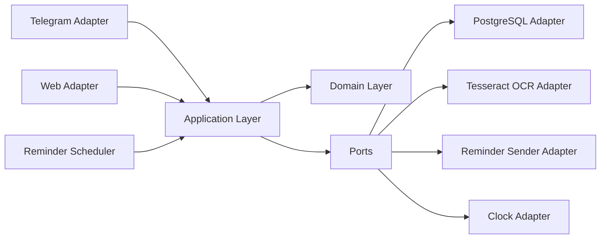
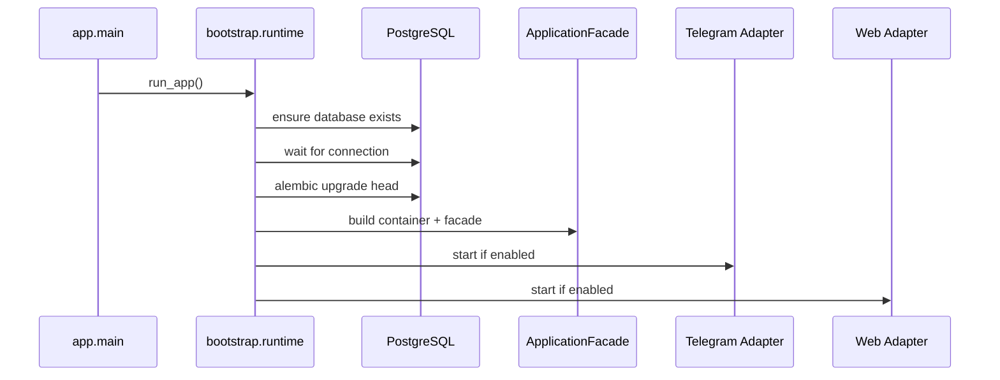

# Architecture

## Purpose

This project is built as a core-first platform where Telegram and web are external adapters. The same business workflows must be reusable from another transport, such as a REST API or another UI, without rewriting the application logic.

## Layered Model



## Layer Responsibilities

### Domain

Location: [app/domain](C:\Users\Kuznetz\Desktop\proga\cashback_bot\app\domain)

Contains pure logic and does not know about Telegram, FastAPI, SQLAlchemy sessions, or transport state.

Key responsibilities:

- domain models such as `UserProfile`, `CashbackDraftItem`, `BankAggregate`
- enums and domain errors
- category normalization and synonym mapping
- natural-language parsing helpers
- ranking rules and tie handling

### Application

Location: [app/application](C:\Users\Kuznetz\Desktop\proga\cashback_bot\app\application)

Contains use cases and workflow orchestration. This is the behavioral center of the system.

Key responsibilities:

- `UserCommand`, `Screen`, `Action`, `WorkflowState`, `WorkflowResult`
- `handle_command(...)` workflow execution
- user sync
- reminder dispatch policy
- logging application events
- persistence and OCR access through ports only

Core contracts:

```python
sync_user(context) -> UserProfile
handle_command(user, workflow_state, command) -> WorkflowResult
send_monthly_reminders() -> int
log_event(user_id, action, payload) -> None
```

### Adapters

Location: [app/adapters](C:\Users\Kuznetz\Desktop\proga\cashback_bot\app\adapters)

Implement infrastructure and transport integration.

- `postgres`: SQLAlchemy models, repositories, unit of work, session factory
- `telegram`: update mapping, callback decoding, inline screen rendering, FSM persistence bridge
- `web`: FastAPI app, Telegram Login verification, SSR templates, session-backed workflow persistence
- `ocr_tesseract`: image preprocessing and OCR extraction
- `scheduler`: reminder async loop
- `system`: clock and reminder sender helpers

### Bootstrap

Location: [app/bootstrap](C:\Users\Kuznetz\Desktop\proga\cashback_bot\app\bootstrap)

Builds the runtime graph.

Responsibilities:

- load settings
- configure logging
- ensure database exists
- build core container and facade
- apply migrations
- run enabled adapters

## Main Runtime Flow



## Workflow Model

The product is screen-driven, not transport-driven.

`WorkflowState` stores:

- current mode (`create`, `edit`, or `None`)
- selected bank reference
- draft cashback items
- editing pointer
- pending input kind
- temporary payload for incomplete actions

`Screen` describes what the UI must render:

- `id`
- `title_key`
- `body_key`
- `body_params`
- `actions`
- `expects_input`
- `layout_hint`

`Action` describes what the UI can submit back:

- `command`
- `label_key`
- `payload`
- `variant`
- `group`
- `destructive`

This lets Telegram and web render the same logical screen with different transport behavior.

## Telegram Flow

Location: [app/adapters/telegram/router.py](C:\Users\Kuznetz\Desktop\proga\cashback_bot\app\adapters\telegram\router.py)

High-level flow:

1. Map message or callback to `UserCommand`.
2. Load workflow state from FSM storage.
3. Call `facade.handle_command(...)`.
4. Save updated workflow state.
5. Render the returned `Screen`.
6. Apply side effects such as transient status messages and event logs.

Telegram-specific concerns stay in the adapter:

- callback parsing
- inline keyboard lifecycle
- temporary photo download
- FSM storage

## Web Flow

Location: [app/adapters/web/app.py](C:\Users\Kuznetz\Desktop\proga\cashback_bot\app\adapters\web\app.py)

High-level flow:

1. Authenticate user with Telegram Login widget.
2. Persist user profile, workflow state, and last screen in session.
3. Convert form submit or upload into `UserCommand`.
4. Call the same application facade.
5. Render `Screen` via SSR template.

Web-specific concerns stay in the adapter:

- session cookies
- Telegram auth verification
- HTML templates and CSS
- file upload handling

## Persistence Model

The durable database stores current user data and business history, not UI session state.

Tables:

- `users`
- `banks`
- `cashback_items`
- `user_logs`

Important rule:

- bank updates replace the full `cashback_items` set atomically inside a transaction

Transport session state is intentionally non-durable:

- Telegram flow state lives in FSM memory storage
- Web flow state lives in signed session storage

## Error Model

Domain and validation failures bubble as domain errors and are rendered by adapters as localized messages.

Examples:

- file too large
- broken image
- OCR returned no usable text
- invalid manual percent
- bank or category not found
- unknown command

Operational failures are logged and surfaced as short user-facing errors without crashing the process.

## Architectural Invariants

- Domain must not import `aiogram`, `fastapi`, `sqlalchemy`, or transport session state.
- Application must not depend on ORM models or `AsyncSession`.
- Adapters may depend on application contracts, never the other way around.
- Telegram and web must use the same `handle_command(...)` core semantics.
- UI navigation must not create dead ends; every screen needs a safe exit path.
