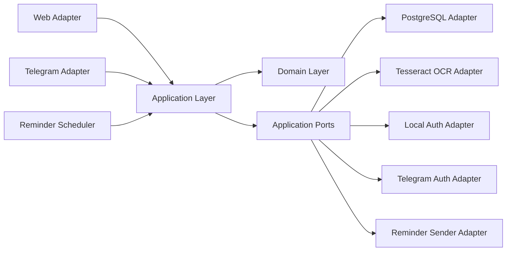
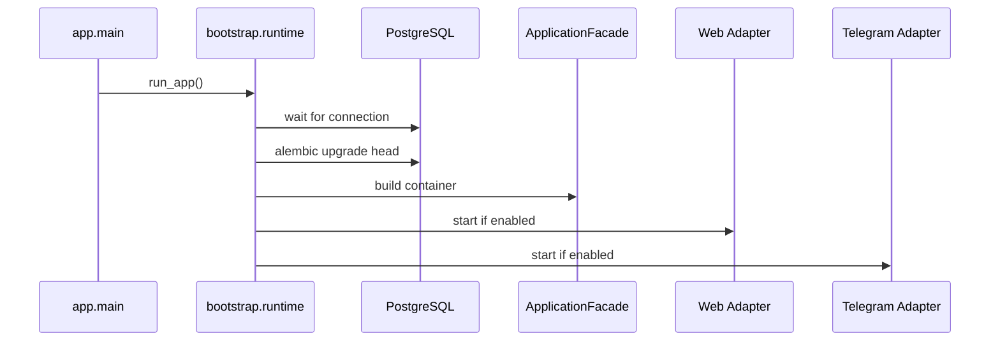

# Architecture

## Purpose

The system is built as a platform core with thin delivery adapters.
Business rules, workflow state, ranking, parsing, and persistence contracts live outside Telegram and outside HTTP.

Current primary platform entry point: web with local credentials.
Current secondary adapter: Telegram.

## Layer Map

## Responsibilities

### Domain

Location: `app/domain`

Contains transport-neutral business entities and domain rules.

Examples:

- `UserAccount`
- `UserIdentity`
- `LocalCredentials`
- `ReminderTarget`
- `BankAggregate`
- `CashbackDraftItem`
- category normalization and ranking services

The domain must not import FastAPI, aiogram, SQLAlchemy, or adapter code.

### Application

Location: `app/application`

Contains use cases, workflow state, transport-neutral screen models, and infrastructure ports.

Main areas:

- `app/application/auth`: registration, login, external identity auth, link, unlink
- `app/application/dto`: neutral DTOs such as `ImageUpload`
- `app/application/use_cases`: business operations for banks, history, reminders, OCR processing
- `app/application/models`: `Screen`, `Action`, `Effect`, `WorkflowState`, `WorkflowResult`

Important rule:
application code may depend on domain and application contracts only.

### Adapters

Location: `app/adapters`

Concrete integration layer.

- `postgres`: repositories, unit of work, SQLAlchemy models
- `auth_local`: password hashing and verification
- `auth_telegram`: Telegram Login verification
- `telegram`: aiogram routing and rendering
- `web`: FastAPI routes, sessions, SSR templates
- `ocr_tesseract`: image-to-text extraction from `ImageUpload`
- `system`: reminder delivery helpers

Adapters may depend on application contracts.
Application and domain must not depend on adapters.

### Bootstrap

Location: `app/bootstrap`

Owns runtime wiring only:

- settings loading
- logging
- database readiness
- migrations
- container assembly
- adapter startup

## Identity Model

The platform no longer treats Telegram as the canonical user identity.

Tables:

- `users`: platform account
- `user_identities`: linked external identities such as Telegram
- `local_credentials`: local username/email/password hash

Design consequences:

- a web user can exist without Telegram
- a Telegram identity can be linked to an existing platform account
- reminder routing is derived from linked identities, not from columns on `users`

## Authentication Model

### Web

Supports:

- local registration
- local login
- logout
- Telegram identity link and unlink

Unlinked Telegram callbacks are not allowed to silently create arbitrary web sessions.
They are accepted only for an already linked identity or for explicit linking from an authenticated session.

### Telegram

Telegram can still create or restore an account through external identity authentication with `provider="telegram"`.
This preserves bot-first compatibility while keeping the platform model neutral.

## Workflow Model

The product remains screen-driven.
Adapters translate transport events into a shared `UserCommand` contract and render the returned `Screen`.

`WorkflowState` stores draft and navigation state such as:

- selected bank
- draft items
- pending input kind
- edit pointer
- interrupt target

`Screen` contains:

- screen id
- title/body localization keys
- action list
- optional input expectation
- optional layout hint

This allows Telegram and web to reuse the same logical workflow semantics.

## File Upload Model

OCR no longer depends on filesystem paths in the application contract.

The application works with `ImageUpload`:

- `content: bytes`
- `filename: str`
- `content_type: str`

Any temporary file handling stays inside the concrete adapter.

## Reminder Delivery

Monthly reminders are now resolved through reminder targets from linked identities.

Current operational behavior:

- the reminder use case queries `user_identities` for Telegram targets
- the system sender delivers `ReminderTarget`
- transport routing is adapter-owned

This removes the old assumption that `users.telegram_user_id` is the only delivery address.

## Runtime Flow

## Invariants

- `app.domain` imports no adapter or framework code.
- `app.application` imports no adapter package or ORM model.
- `app.adapters.web` does not import `app.adapters.telegram`.
- shared localization lives in `app.i18n`.
- adapters are replaceable without rewriting business rules.

## Known Limitation

The refactor extracted major business operations out of the workflow layer, but `HandleCommandUseCase` is still the main orchestration entry point and remains larger than the target end state.

What is already done:

- auth split out into dedicated use cases
- bank/history/reminder operations split into dedicated use cases
- OCR moved behind transport-neutral upload DTOs

What remains for a later wave:

- move scenario orchestration from `HandleCommandUseCase` into a dedicated `app/application/workflow` package
- reduce command branching and presentation helpers inside that class
