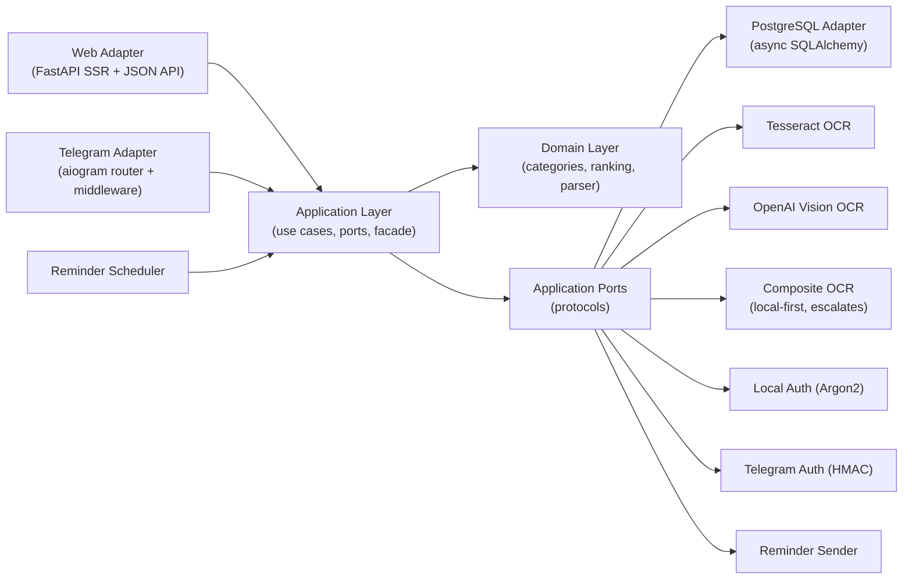
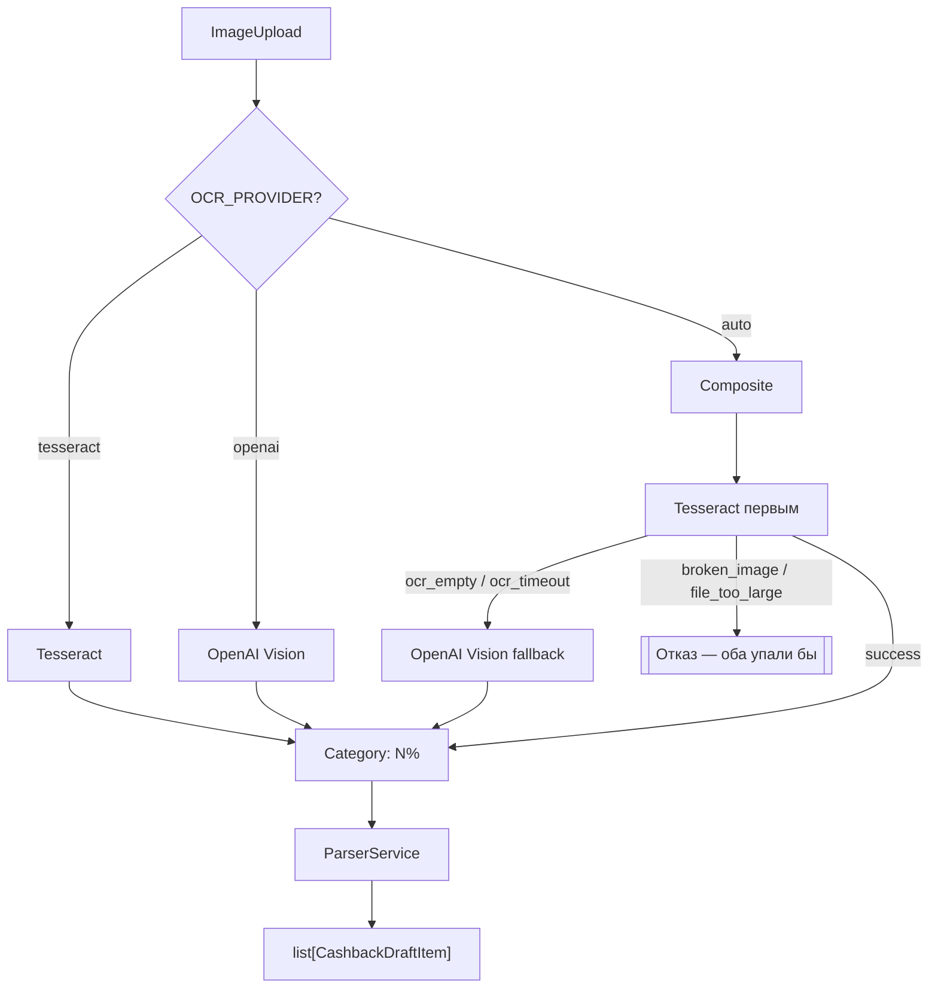
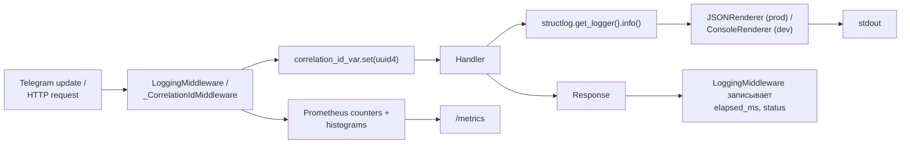

# Архитектура

Русская версия; полный английский вариант — [`docs/ARCHITECTURE.md`](../ARCHITECTURE.md).

## Назначение

Проект построен как **платформенное ядро с тонкими адаптерами доставки**.
Бизнес-правила, workflow-состояние, ранжирование, парсинг и контракты
персистентности живут **вне** Telegram и **вне** HTTP. Это значит:

- Новый канал доставки (например, нативный мобильный) добавляется без
  изменения доменной логики.
- Все use cases юнит-тестируются без Telegram-бота и web-сервера —
  in-memory UoW в `tests/conftest.py` заменяет Postgres.
- Особенности очередного транспорта (CLI, webhook от биллинга)
  подключаются на уровне адаптера и наследуют все инварианты ядра.

Текущий основной entry-point: **web с локальными креденшиалами**.
Текущий вторичный адаптер: **Telegram** (polling или webhook).

---

## Схема слоёв



Направление зависимостей — **снаружи внутрь запрещено**. Domain не знает о
портах application, application не знает об адаптерах, адаптеры не знают
друг о друге (одно явное исключение — общие утилиты через
`app/adapters/rate_limit.py`).

Инварианты проверяются `tests/test_architecture_boundaries.py`.

---

## Ответственности

### Domain (`app/domain`)

Транспорт-нейтральные бизнес-сущности и правила.

| Модуль | Содержимое |
|---|---|
| `models.py` | `UserAccount`, `UserIdentity`, `LocalCredentials`, `Bank`, `CashbackDraftItem`, `ReminderTarget`, `NormalizedCategory`, `CategoryLeader`, `UserLogEntry` |
| `errors.py` | Иерархия `DomainError`: `NotFoundError`, `ValidationError`, и др. Каждая ошибка несёт translation-ключ `errors.*` |
| `services/categories.py` | `CategoryService.normalize()`, `display_name()`, `expand_query_slugs()`, `template_slugs()`. LRU-кеш (2048) |
| `services/ranking.py` | `RankingService` — сводит `list[RankingEntry]` в `top_by_category()`, `top_global()`, `best_for_slug()` |
| `services/parsing.py` | `ParserService.parse_manual_lines()`, `parse_ocr_text()` |

**Правило:** domain **не** может импортировать `aiogram`, `fastapi`,
`sqlalchemy`, ничего из `app.adapters.*`. Enforced.

### Application (`app/application`)

Use cases, workflow-state, транспорт-нейтральные screen-модели, порты
инфраструктуры.

| Модуль | Содержимое |
|---|---|
| `facade.py` | `ApplicationFacade` — единый entry-point для каждого адаптера |
| `contracts/ports.py` | `UnitOfWorkPort`, `BankRepositoryPort`, `CashbackRepositoryPort`, `OCRPort`, `ReminderSenderPort`, `ClockPort`, `RankingReaderPort` |
| `dto/media.py` | `ImageUpload(content: bytes, filename: str, content_type: str)` |
| `use_cases/` | Один класс на use case |
| `auth/` | Registration, login, external-identity, link/unlink |
| `presenters/` | Workflow → Screen |
| `models.py` | `UserCommand`, `Screen`, `Action`, `Effect`, `WorkflowState`, `WorkflowResult` |

**Правило:** application зависит от domain и своих же контрактов. Ни ORM
моделей, ни `aiogram`-импортов.

### Adapters (`app/adapters`)

Конкретный слой интеграции. Каждый адаптер зависит от контрактов
application (протоколов), не от других адаптеров.

| Адаптер | Ответственность |
|---|---|
| `postgres/` | `async_sessionmaker` + SQLAlchemy 2.0 async-модели. `PostgresUnitOfWork` оборачивает session как `UnitOfWorkPort` |
| `telegram/` | `router.py`, `middleware.py`, `inline.py`, `renderer.py`, `callbacks.py`, `deep_links.py`, `state.py`, `rate_limit.py` (re-export) |
| `web/` | FastAPI app, SSR Jinja-шаблоны, session-middleware, `/health`, `/metrics`, `/api/best`, `/bot/webhook`, rate-limiter, CORS, correlation id |
| `ocr_tesseract/` | Tesseract subprocess через `pytesseract` + image pre-processing |
| `ocr_openai_vision/` | OpenAI-совместимый chat-completions с image content. Hardened JSON-parsing |
| `ocr_composite/` | Tesseract первым, OpenAI — только на empty/timeout |
| `ocr_metrics.py` | `MetricsOCRAdapter` — инкремент `cashback_bot_ocr_calls_total` |
| `scheduler/` | `ReminderLoop` — asyncio-таск |
| `auth_local/` | Argon2 password hashing/verify |
| `auth_telegram/` | Telegram Login HMAC-верификация |
| `system/` | System clock, `NoopReminderSender` |
| `rate_limit.py` | **Общий** `TokenBucketRateLimiter` для telegram и web |

**Правило:** `app.adapters.web` **не** импортирует `app.adapters.telegram.*`
и наоборот. Общее — в `app/adapters/<name>.py` (peer).

### Bootstrap (`app/bootstrap`)

Runtime-wiring, без бизнес-логики.

| Модуль | Содержимое |
|---|---|
| `config.py` | `Settings` (Pydantic v2). Все env-переменные. Field/model validators для fail-fast |
| `container.py` | `build_core_container(settings, metrics)` → `CoreContainer`. `build_application_facade(core, reminder_sender)` |
| `runtime.py` | `run_app()`. `build_fsm_storage(settings)` — Memory/Redis. `_run_telegram_adapter` / `_run_webhook_adapter` |
| `db_startup.py` | Автосоздание БД |
| `logger.py` | `configure_logging(level)` — structlog-pipeline |
| `correlation.py` | `correlation_id_var: ContextVar[str]` |
| `metrics.py` | `MetricsRegistry` — общие Prometheus-коллекторы |

---

## Модель идентификации

### Таблицы

| Таблица | Ключевые поля |
|---|---|
| `users` | `id`, `display_name`, `language`, `notifications_enabled`, `telegram_user_id` (nullable для обратной совместимости) |
| `user_identities` | `(id, user_id, provider, provider_user_id, …)`. Уникальные ключи `(provider, provider_user_id)` и `(user_id, provider)` |
| `local_credentials` | `(id, user_id, username, email, password_hash)`. Уникально на `user_id`, `username`, `email` |

### Следствия

- Web-пользователь может существовать **без** Telegram-идентификации.
- Telegram-identity привязывается к существующему аккаунту.
- Routing напоминаний запрашивает `user_identities` — не
  `users.telegram_user_id` — так что email/push добавятся без смены схемы.

### Цепочка миграций

1. `20260306_0001_initial.py` — базовая схема.
2. `20260311_0002_platform_identity.py` — split telegram → `user_identities`.
3. `20260424_0003_performance_indexes.py` — покрывающий индекс
   `cashback_items(bank_id, normalized_category)` + композитный
   `user_logs(user_id, action, created_at)`.

---

## Модель аутентификации

### Web

- Local register: `POST /auth/register`
- Local login: `POST /auth/login`
- Logout: `POST /auth/logout`
- Telegram callback / link: `GET /auth/telegram/callback`
- Telegram unlink: `POST /auth/telegram/unlink`

Непривязанный Telegram-callback **не** создаёт silent web-сессию. Принимается
только для:

1. Уже привязанной identity (login flow).
2. Явной привязки из авторизованной локальной сессии.

### Telegram

Бот по-прежнему создаёт/восстанавливает аккаунт через
`AuthenticateExternalIdentityUseCase(provider="telegram")` —
bot-first совместимость без компромисса платформенной модели.

---

## Workflow-модель

Продукт **screen-driven**. Адаптеры превращают транспортные события в общий
`UserCommand`, прогоняют через `ApplicationFacade.handle_command` и
рендерят возвращённый `Screen`.

### UserCommand

```python
@dataclass(slots=True, frozen=True)
class UserCommand:
    name: str              # "open_home" / "save_bank" / "submit_text" / …
    payload: dict = {}
```

### WorkflowState

Хранит draft-ы и навигацию:

- `selected_bank_id`
- `draft_bank_name`
- `draft_items`
- `edit_pointer`
- `pending_input_kind`: `"photo_upload"` / `"manual_lines"` / `"item_percent"` / `None`
- `interrupt_target`

Сериализуется в FSM-хранилище (memory или Redis) между запросами.

### Screen

```python
@dataclass(slots=True, frozen=True)
class Screen:
    id: str
    title_key: str
    body_key: str
    body_params: dict
    actions: list[Action]       # inline keyboard
    expects_input: str | None
    layout_hint: str
```

И Telegram, и web переиспользуют эту семантику.

---

## Модель загрузки файлов

OCR в контракте application не зависит от файловых путей.

```python
@dataclass(slots=True, frozen=True)
class ImageUpload:
    content: bytes
    filename: str
    content_type: str
```

Telegram-адаптер скачивает фото в `BytesIO` и оборачивает; web-адаптер
читает `UploadFile` так же. Temp-файлы — проблема конкретного OCR-адаптера.

---

## Архитектура OCR-pipeline



Оба адаптера мапят ошибки в translation-ключи:

- `errors.ocr_empty`, `errors.ocr_timeout`, `errors.ocr_unavailable`
- `errors.ocr_parse_invalid`, `errors.broken_image`, `errors.file_too_large`

Router конвертирует их в recovery-клавиатуры (`_OCR_RETRYABLE_KEYS`).

---

## Стратегия кеширования

### Нормализация категорий

- LRU-кеш по raw input.
- Размер: 2048.
- Инвалидация только при рестарте процесса.
- `cache_stats()` / `clear_cache()` для тестов и ops.

### Ranking-снапшоты

- Процесс-wide dict `_entries_cache[user_id] → (entries, expires_at)`.
- TTL: 30 с.
- **Инвалидация на запись**: `SaveBankDraftUseCase`, `DeleteBankUseCase`,
  `DeleteCategoryUseCase` дёргают `RankingSnapshotUseCase.invalidate(user_id)`
  сразу после `uow.commit()`.
- **Sweep**: каждые 256 чтений expired-записи удаляются.

### OCR

- Без кеша — адаптер stateless per request. Стоимость — сеть (OpenAI)
  или CPU (Tesseract), не повторное чтение одной картинки.

---

## Доставка напоминаний

Ежемесячные напоминания разрешаются через **привязанные identities**, не
через поле `users.telegram_user_id`.

```
ReminderLoop (asyncio-таск)
  ↓ каждые REMINDER_INTERVAL
SendMonthlyRemindersUseCase.execute()
  ↓ для каждого пользователя с включёнными уведомлениями
Список reminder-target'ов из user_identities (provider='telegram')
  ↓ для каждого target
Dedup через UserLogEntry 'reminder_sent' в текущем месяце
  ↓ если не отправляли
ReminderSenderPort.send_monthly_reminder(target)
  ↓
Адаптер форматирует и шлёт сообщение
```

Будущие email-напоминания — новая реализация `ReminderSenderPort`.

---

## Архитектура наблюдаемости



### Жизненный цикл correlation_id

1. **Выставляется** на краю: `LoggingMiddleware` (Telegram) /
   `_CorrelationIdMiddleware` (web).
2. **Распространяется** через `contextvars.ContextVar` — переживает `await`
   в пределах одной task.
3. **Читается** structlog-процессором `_add_correlation_id` — попадает
   в каждый log-record.

Кросс-корреляция: web-middleware **читает** `X-Request-Id` из входящего
запроса (если upstream-proxy проставил), так один trace-id покрывает
nginx → FastAPI → Postgres-логи.

---

## Runtime Flow

```mermaid
sequenceDiagram
    participant Main as app.main
    participant Runtime as bootstrap.runtime
    participant Cfg as Settings
    participant DB as PostgreSQL
    participant Migr as Alembic
    participant Facade as ApplicationFacade
    participant Web as FastAPI
    participant Tg as Dispatcher
    participant Loop as ReminderLoop

    Main->>Runtime: run_app()
    Runtime->>Cfg: get_settings()
    Runtime->>Runtime: configure_logging()
    Runtime->>Runtime: _validate_startup_settings()
    Runtime->>DB: ensure_database_exists()
    Runtime->>DB: wait for readiness (retries)
    Runtime->>Migr: alembic upgrade head
    Runtime->>Facade: build container + facade
    Runtime->>Loop: start()
    alt WEBHOOK_ENABLED
        Runtime->>Tg: build_dispatcher()
        Runtime->>Web: start_webhook_adapter()
        Runtime->>Tg: bot.set_webhook(url, secret)
    else polling
        Runtime->>Tg: start_polling_adapter()
        Runtime->>Tg: bot.delete_webhook()
    end
    Runtime->>Web: start_web_adapter() [если APP_ENABLE_WEB]
    Runtime->>Runtime: ждём shutdown signal
    Runtime->>Tg: dp.storage.close(), bot.session.close()
    Runtime->>Loop: stop()
    Runtime->>DB: engine.dispose()
```

---

## Инварианты (проверяются тестами)

| Инвариант | Тест |
|---|---|
| `app.domain` не импортирует адаптеры, `aiogram`, `fastapi`, `sqlalchemy` | `test_domain_and_application_do_not_import_adapters_or_frameworks` |
| `app.application` не импортирует адаптеры, фреймворки, ORM | (тот же) |
| `app.adapters.web` не импортирует `app.adapters.telegram.*` | `test_web_adapter_does_not_import_telegram_adapter_modules` |
| Общая локализация — в `app.i18n` (не в адаптере) | `test_shared_i18n_module_is_not_hidden_under_telegram_adapter` |
| Workflow/presenters не тянут `UnitOfWorkPort`/`uow_factory`/`AsyncSession` | `test_workflow_and_presenters_do_not_pull_persistence_concerns` |
| `.env.example` содержит каждую env, которую читает `Settings` | `test_env_example_contains_required_keys` |

Break one → `pytest` падает. В этом и смысл.

---

## Ограничение

Рефакторинг вынес крупные бизнес-операции из workflow-слоя, но
`HandleCommandUseCase` (`app/application/use_cases/handle_command.py`)
всё ещё главный orchestrator и больше целевого размера.

### Готово

- Auth разнесён по dedicated use cases.
- Bank / history / reminder — по dedicated use cases.
- OCR за транспорт-нейтральным `ImageUpload`.
- Кеши инвалидируются на запись.
- Bulk ranking-JOIN заменяет N+1.

### В следующем волне

- Перенести scenario orchestration из `HandleCommandUseCase` в отдельный
  пакет `app/application/workflow`.
- Уменьшить command-branching и presentation-хелперы внутри класса.
- Extract `LogEventUseCase` за dedicated port.

---

## Deep-dive

- [Layered core refactor](../architecture/platform-core-refactor.md) (EN)
- [Identity clean-break миграция](../migrations/identity-clean-break.md) (EN)
- [Repository-integrity audit](../audits/repository-integrity-audit.md) (EN)
