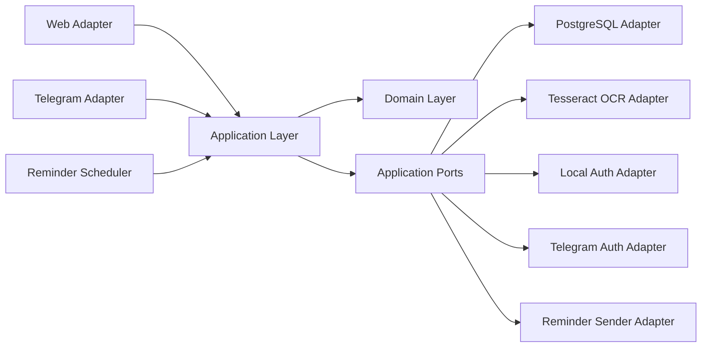
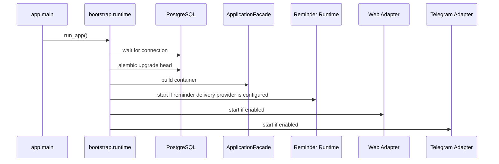

# Архитектура

## Назначение

Система построена как platform core с тонкими delivery adapters.
Business rules, workflow state, ranking, parsing и persistence contracts живут вне Telegram и вне HTTP.

Текущая основная platform surface: web с local credentials.
Текущий secondary adapter: Telegram.

Важная оговорка:

- архитектура уже web-first
- code defaults и `.env.example` теперь по умолчанию задают web-first local mode
- Telegram features включаются явно через config, а не через bootstrap bias

## Карта слоёв

## Ответственность слоёв

### Domain

Расположение: `app/domain`

Содержит transport-neutral business entities и domain rules.

Примеры:

- `UserAccount`
- `UserIdentity`
- `LocalCredentials`
- `DeliveryTarget`
- `BankAggregate`
- `CashbackDraftItem`
- category normalization и ranking services

Domain не должен импортировать FastAPI, aiogram, SQLAlchemy или adapter code.

### Application

Расположение: `app/application`

Содержит use cases, workflow state, transport-neutral screen models и infrastructure ports.

Основные зоны:

- `app/application/auth`: registration, login, external identity auth, link, unlink
- `app/application/dto`: transport-neutral DTO, например `ImageUpload`
- `app/application/use_cases`: business operations для banks, history, reminders, OCR processing
- `app/application/workflow`: workflow contracts, dispatcher, scenario handlers
- `app/application/presenters`: screen factories и formatting helpers

Правило:

application code может зависеть только от domain и application contracts.

### Adapters

Расположение: `app/adapters`

Concrete integration layer.

- `postgres`: repositories, unit of work, SQLAlchemy models
- `auth_local`: password hashing и verification
- `auth_telegram`: Telegram Login verification
- `telegram`: aiogram routing и rendering
- `web`: FastAPI routes, sessions, SSR templates
- `ocr_tesseract`: image-to-text extraction из `ImageUpload`
- `system`: reminder delivery helpers

Adapters могут зависеть от application contracts.
Application и domain не должны зависеть от adapters.

### Bootstrap

Расположение: `app/bootstrap`

Отвечает только за runtime wiring:

- загрузка settings
- logging
- readiness базы
- migrations
- сборка container
- startup adapters
- lifecycle reminder loop, если reminder delivery provider явно сконфигурирован

## Identity Model

Платформа больше не считает Telegram канонической user identity.

Таблицы:

- `users`: platform account
- `user_identities`: linked external identities, например Telegram
- `local_credentials`: local username/email/password hash

Следствия:

- web user может существовать без Telegram
- Telegram identity может быть привязана к существующему platform account
- reminder routing определяется через linked identities, а не через поля `users`

Compatibility note:

- legacy `users.telegram_user_id`, `username` и `full_name` остаются в schema как deprecated compatibility seam
- новая runtime-логика больше не зеркалит linked Telegram identity обратно в эти колонки
- новым application/business code нельзя считать эти legacy fields authoritative source

## Authentication Model

### Web

Поддерживает:

- local registration
- local login
- logout
- Telegram identity link и unlink

Unlinked Telegram callbacks не могут молча создавать произвольные web sessions.
Они принимаются только для уже linked identity или для explicit linking из authenticated session.

### Telegram

Telegram adapter локально маппит `from_user` в `ExternalIdentityContext(provider="telegram", ...)`, а затем вызывает shared external identity authentication use case.
Это сохраняет bot-first compatibility без возврата к telegram-centric core model.

## Workflow Model

Продукт остаётся screen-driven.
Adapters переводят transport events в общий `UserCommand` и рендерят возвращённый `Screen`.

`WorkflowState` хранит:

- selected bank
- target month
- draft items
- pending input kind
- edit pointer
- interrupt target

`Screen` описывает:

- screen id
- title/body localization keys
- action list
- optional input expectation
- optional layout hint

Текущий workflow split:

- `dispatcher.py`: orchestration и routing
- `interrupts.py`: interrupt policy
- `draft.py`: draft creation/edit/save flow
- `banks.py`: saved-bank flow
- `navigation.py`: home/help/top/settings/history flow
- `text_intents.py`: free-text routing
- `workflow_screens.py`: построение `Screen`
- `workflow_formatters.py`: форматирование screen body

Благодаря этому Telegram и web переиспользуют одну и ту же логическую семантику workflow.

## Month Snapshot Model

Cashback data теперь хранится как month-aware snapshots вместо одного mutable bank state.

Следствия:

- один и тот же банк может иметь разные наборы категорий для `previous`, `current` и `next` month
- OCR/manual/template ingestion сначала создаёт draft, затем draft привязывается к банку и target month
- bank details и edit flow работают с месяцем явно, не перетирая другой snapshot случайно

Persistence consequences:

- `cashback_items` содержит `target_month`
- repository operations month-scoped для list/replace behavior
- ranking использует только current month snapshot

## OCR And Attach Flow

Упрощённый ingestion flow намеренно transport-neutral:

1. adapter отправляет image bytes или text в workflow
2. workflow парсит категории в draft
3. если банк уже выбран, preview открывается сразу
4. если сохранён ровно один банк, workflow выбирает его автоматически
5. иначе открывается явный attach-to-bank screen
6. пользователь подтверждает target month и сохраняет результат

Цель:

- скриншот или фото должны сразу вести к полезному следующему действию, а не к тупиковому OCR output

## File Upload Model

OCR больше не зависит от filesystem paths в application contract.

Application работает с `ImageUpload`:

- `content: bytes`
- `filename: str`
- `content_type: str`

Любая временная работа с файлами остаётся внутри конкретного adapter.

## Reminder Delivery

Ежемесячные reminders теперь разрешаются через delivery targets из linked identities.

Текущее operational behavior:

- reminder use case запрашивает `user_identities` через `list_delivery_targets(...)`
- delivery provider инжектируется через bootstrap/runtime wiring через `REMINDER_DELIVERY_PROVIDER`
- sender adapter доставляет `DeliveryTarget`
- `bootstrap.runtime` владеет lifecycle reminder loop
- Telegram bot остаётся текущей delivery implementation, но не owner scheduler
- bundled compose posture закрепляет ownership reminder delivery только за Telegram profile service

Это убирает старое предположение, что `users.telegram_user_id` — единственный delivery address.

## Runtime Flow

## Invariants

- `app.domain` не импортирует adapter или framework code
- `app.application` не импортирует adapter packages или ORM models
- `app.application.workflow` не импортирует framework или persistence boundary напрямую
- `app.application.presenters` не импортирует adapters
- `app.adapters.web` не импортирует `app.adapters.telegram`
- shared localization живёт в `app.i18n`
- adapters можно менять без переписывания business rules

## Residual Technical Debt

Крупная workflow decomposition завершена.
Оставшийся debt теперь уже уже и конкретнее:

- `app/application/workflow/draft.py` — самый крупный workflow module и следующий hotspot
- legacy Telegram columns остаются в schema как deprecated compatibility seam
- пока существует только Telegram implementation для reminder delivery; другие providers остаются отдельной задачей

Это compatibility и maintenance concerns, а не архитектурные блокеры.
