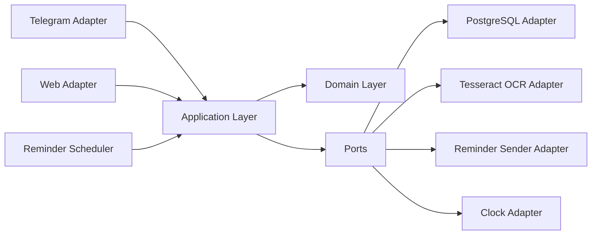
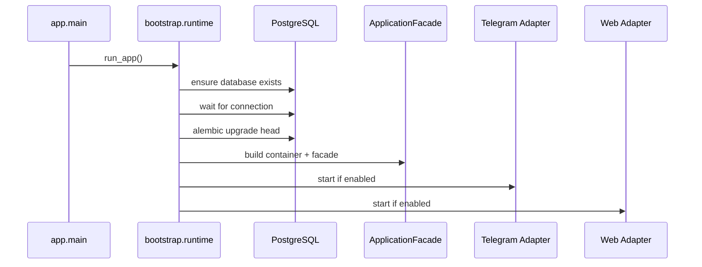

# Архитектура

## Назначение

Проект построен как core-first платформа, где Telegram и web являются внешними адаптерами. Бизнес-сценарии должны переиспользоваться из другого транспорта, например REST API или другого UI, без переписывания application logic.

## Слоистая модель



## Ответственность слоев

### Domain

Расположение: [app/domain](C:\Users\Kuznetz\Desktop\proga\cashback_bot\app\domain)

Содержит чистую доменную логику и не знает о Telegram, FastAPI, SQLAlchemy session и transport state.

Основные обязанности:

- доменные модели: `UserProfile`, `CashbackDraftItem`, `BankAggregate`
- enums и domain errors
- нормализация категорий и работа с синонимами
- parsing helpers для natural language
- ranking rules и tie-handling

### Application

Расположение: [app/application](C:\Users\Kuznetz\Desktop\proga\cashback_bot\app\application)

Содержит use cases и orchestration пользовательских workflow. Это поведенческий центр системы.

Основные обязанности:

- `UserCommand`, `Screen`, `Action`, `WorkflowState`, `WorkflowResult`
- workflow execution через `handle_command(...)`
- user sync
- reminder policy
- application event logging
- доступ к persistence и OCR только через ports

Основные контракты:

```python
sync_user(context) -> UserProfile
handle_command(user, workflow_state, command) -> WorkflowResult
send_monthly_reminders() -> int
log_event(user_id, action, payload) -> None
```

### Adapters

Расположение: [app/adapters](C:\Users\Kuznetz\Desktop\proga\cashback_bot\app\adapters)

Реализуют transport и infrastructure integration.

- `postgres`: SQLAlchemy models, repositories, unit of work, session factory
- `telegram`: update mapping, callback decoding, inline screen rendering, FSM bridge
- `web`: FastAPI app, Telegram Login verification, SSR templates, session-backed workflow persistence
- `ocr_tesseract`: image preprocessing и OCR extraction
- `scheduler`: reminder async loop
- `system`: clock и reminder sender helpers

### Bootstrap

Расположение: [app/bootstrap](C:\Users\Kuznetz\Desktop\proga\cashback_bot\app\bootstrap)

Собирает runtime graph.

Обязанности:

- загрузка settings
- конфигурация logging
- проверка и создание базы
- сборка core container и facade
- применение миграций
- запуск включенных адаптеров

## Основной runtime flow



## Workflow model

Продукт является screen-driven, а не transport-driven.

`WorkflowState` хранит:

- текущий mode (`create`, `edit` или `None`)
- ссылку на выбранный банк
- draft cashback items
- индекс редактируемого item
- ожидаемый тип ввода
- временный payload для незавершенных действий

`Screen` описывает, что должен отрисовать UI:

- `id`
- `title_key`
- `body_key`
- `body_params`
- `actions`
- `expects_input`
- `layout_hint`

`Action` описывает, что UI может отправить обратно:

- `command`
- `label_key`
- `payload`
- `variant`
- `group`
- `destructive`

Благодаря этому Telegram и web могут отображать один и тот же логический экран по-разному, не меняя business semantics.

## Telegram flow

Расположение: [app/adapters/telegram/router.py](C:\Users\Kuznetz\Desktop\proga\cashback_bot\app\adapters\telegram\router.py)

Высокоуровневый flow:

1. Преобразовать message или callback в `UserCommand`.
2. Загрузить workflow state из FSM storage.
3. Вызвать `facade.handle_command(...)`.
4. Сохранить обновленное workflow state.
5. Отрендерить `Screen`.
6. Применить side effects: transient status, logs и т.д.

Telegram-specific concerns остаются в адаптере:

- callback parsing
- lifecycle inline keyboard
- временная загрузка фото
- FSM storage

## Web flow

Расположение: [app/adapters/web/app.py](C:\Users\Kuznetz\Desktop\proga\cashback_bot\app\adapters\web\app.py)

Высокоуровневый flow:

1. Аутентифицировать пользователя через Telegram Login widget.
2. Сохранить в session user profile, workflow state и last screen.
3. Преобразовать form submit или upload в `UserCommand`.
4. Вызвать тот же application facade.
5. Отрендерить `Screen` через SSR template.

Web-specific concerns остаются в адаптере:

- session cookies
- Telegram auth verification
- HTML templates и CSS
- file upload handling

## Persistence model

Долговременная база хранит business data и историю, но не хранит UI session state.

Таблицы:

- `users`
- `banks`
- `cashback_items`
- `user_logs`

Ключевое правило:

- при обновлении банка полный набор `cashback_items` заменяется атомарно в рамках транзакции

Transport session state специально недолговечен:

- Telegram flow state живет в FSM memory storage
- Web flow state живет в signed session storage

## Error model

Domain и validation failures поднимаются как domain errors и отображаются адаптерами в локализованные сообщения.

Примеры:

- слишком большой файл
- битое изображение
- OCR не дал полезного текста
- невалидный процент
- банк или категория не найдены
- неизвестная команда

Операционные ошибки логируются и показываются как короткие user-facing ошибки без падения процесса.

## Архитектурные инварианты

- Domain не должен импортировать `aiogram`, `fastapi`, `sqlalchemy` или transport session state.
- Application не должен зависеть от ORM models или `AsyncSession`.
- Adapters могут зависеть от application contracts, но не наоборот.
- Telegram и web должны использовать одну и ту же семантику `handle_command(...)`.
- UI navigation не должна создавать dead ends: на каждом экране нужен безопасный путь выхода.
